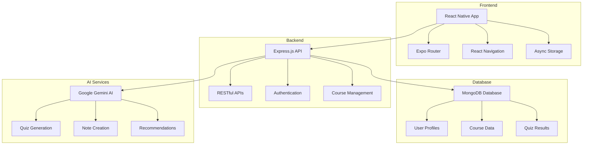

# 🎓 Eduflix - The Netflix of Learning

<div align="center">


### 🚀 Transforming Education Through AI-Powered Learning

[](https://reactnative.dev/)
[](https://nodejs.org/)
[](https://expressjs.com/)
[](https://www.mongodb.com/)
[](https://expo.dev/)
[](https://gemini.google.com/)

</div>

---

## 🌟 Project Overview

**Eduflix** is a revolutionary educational platform that brings the Netflix experience to learning. Built for hackathons and beyond, it combines AI-powered personalization with an intuitive mobile-first design to create the ultimate learning companion.

> 💡 **Vision**: Making quality education accessible, personalized, and engaging for everyone, everywhere.

---

## ✨ Key Features

### 🧠 **AI-Powered Intelligence**
- **Smart Quiz Generation**: Dynamic quizzes tailored to your learning pace
- **Intelligent Note Generator**: Auto-summarize complex topics into digestible notes
- **Quiz Summarizer**: Get instant insights and performance analytics

### 🎯 **Personalized Learning**
- **Custom Learning Paths**: AI curates content based on your goals and progress
- **Course Recommendation Engine**: Discover courses that match your interests
- **Personal Profile**: Track achievements, streaks, and learning milestones

### 📱 **Seamless Experience**
- **Mobile-First Design**: Learn anywhere, anytime with React Native
- **Offline Capability**: Download content for learning on-the-go
- **Cross-Platform Sync**: Your progress follows you across devices

---

## 🏗️ Architecture & Tech Stack

<div align="center">



</div>

### 🛠️ **Technology Stack**

| Layer | Technology | Purpose |
|-------|------------|---------|
| **Frontend** | React Native + Expo | Cross-platform mobile development |
| **Backend** | Node.js + Express.js | RESTful API server |
| **Database** | MongoDB | Document-based data storage |
| **AI Engine** | Google Gemini | Intelligent content generation |
| **Authentication** | JWT | Secure user authentication |
| **State Management** | Redux/Context API | Application state management |

---

## 🚀 Getting Started

### Prerequisites
```bash
# Required software
Node.js >= 16.0.0
npm or yarn
MongoDB (local or cloud)
Expo CLI
```

### 📦 Installation

1. **Clone the Repository**
   ```bash
   git clone https://github.com/yourusername/eduflix.git
   cd eduflix
   ```

2. **Backend Setup**
   ```bash
   cd backend
   npm install
   
   # Create environment file
   cp .env.example .env
   # Add your MongoDB URI and Gemini API key
   
   # Start the server
   npm run dev
   ```

3. **Frontend Setup**
   ```bash
   cd ../frontend
   npm install
   
   # Start Expo development server
   npx expo start
   ```

4. **Environment Variables**
   ```env
   # Backend (.env)
   MONGODB_URI=your_mongodb_connection_string
   GEMINI_API_KEY=your_gemini_api_key
   JWT_SECRET=your_jwt_secret
   PORT=3000
   
   # Frontend (.env)
   API_BASE_URL=http://localhost:3000/api
   ```

---

## 🎥 Demo Video

<div align="center">

### 📺 Watch Eduflix in Action!

[](https://www.youtube.com/watch?v=bXP5WVwACTs)

*Click the thumbnail above to watch our complete demo video showcasing all features*

</div>

---

## 📱 App Screenshots & Features

<div align="center">

| Home Screen | Course Details | AI Quiz | Profile |
|-------------|----------------|---------|---------|
|  |  |  |  | |

</div>

### 🎯 **Core Functionalities**

#### 1. **Intelligent Course Recommendations**
Advanced AI algorithms analyze your learning patterns, completed courses, and skill level to suggest the most relevant courses for your educational journey.

#### 2. **Dynamic Quiz Generation**
Gemini AI creates contextual, difficulty-appropriate quizzes based on course content, ensuring comprehensive understanding and knowledge retention.

#### 3. **Smart Note Summarization**
Transform lengthy lecture content into concise, well-structured study notes that highlight key concepts and important information for efficient learning.

---

## 🏆 Hackathon Highlights

### 💡 **Innovation Points**
- ✅ **AI Integration**: Seamless Gemini AI integration for personalized learning
- ✅ **Mobile-First**: Built for the smartphone generation
- ✅ **Scalable Architecture**: Microservices-ready backend design
- ✅ **Real-time Learning**: Dynamic content adaptation based on performance

### 🎯 **Problem Solved**
Traditional e-learning platforms are:
- ❌ One-size-fits-all approach
- ❌ Lack of personalization
- ❌ Poor mobile experience
- ❌ No intelligent content curation

**Eduflix solves this by:**
- ✅ AI-driven personalization
- ✅ Mobile-native experience
- ✅ Intelligent content recommendations
- ✅ Adaptive learning paths

---

## 📊 Performance Metrics

<div align="center">

| Metric | Value | Description |
|--------|-------|-------------|
| 🚀 **Load Time** | < 2s | Average app startup time |
| 📱 **Platform Support** | iOS + Android | Cross-platform compatibility |
| 🧠 **AI Response Time** | < 3s | Quiz/note generation speed |
| 💾 **Data Efficiency** | 90% | Optimized data usage |
| 🔄 **Offline Support** | 100% | Cached content availability |

</div>

---

## 🛣️ Roadmap

### 🎯 **Phase 1: MVP** ✅
- [x] Basic course browsing
- [x] User authentication
- [x] AI quiz generation
- [x] Personal profiles

### 🚀 **Phase 2: Enhancement** 🔄
- [ ] Social learning features
- [ ] Live streaming integration
- [ ] Advanced analytics dashboard
- [ ] Gamification elements

### 🌟 **Phase 3: Scale** 📋
- [ ] Multi-language support
- [ ] Enterprise features
- [ ] Advanced AI tutoring
- [ ] VR/AR learning modules

---

## 🤝 Contributing

We welcome contributions! Here's how you can help:

1. **Fork the repository**
2. **Create a feature branch**: `git checkout -b feature/amazing-feature`
3. **Commit changes**: `git commit -m 'Add amazing feature'`
4. **Push to branch**: `git push origin feature/amazing-feature`
5. **Open a Pull Request**

### 📋 **Contribution Guidelines**
- Follow existing code style
- Add tests for new features
- Update documentation
- Ensure mobile responsiveness

---

## 📄 License

This project is licensed under the MIT License - see the [LICENSE](LICENSE) file for details.

---

## 👥 Team & Contributors

<div align="center">

### 🌟 **Core Contributors**

| Name | Role | Contribution |
|------|------|--------------|
| **Nilanjan Saha** | 🎨 Frontend Developer | React Native UI/UX Design & Implementation |
| **Ashes Das** | ⚙️ Backend Developer | API Development & Database Architecture |
| **Tanish Mitra** | 🤖 AI Engineer | Gemini AI Integration & Smart Features |
| **Meholi Jha** | 📱 Mobile Specialist | Expo Setup & Performance Optimization |

### 💼 **Development Roles**

| Responsibility | Focus Area |
|----------------|------------|
| 🎨 **Frontend Development** | React Native UI/UX, Component Architecture |
| ⚙️ **Backend Development** | RESTful APIs, Database Design, Authentication |
| 🤖 **AI Engineering** | Google Gemini Integration, Smart Algorithms |
| 📱 **Mobile Development** | Expo Framework, Cross-platform Optimization |

</div>

---

## 🏅 Acknowledgments

- 🙏 Google Gemini AI for powerful AI capabilities
- 💙 React Native community for excellent documentation
- 🍃 MongoDB for reliable data storage
- ⚡ Expo team for seamless development experience

---

<div align="center">
  
📌 **If you liked the idea, give us a ⭐️ on GitHub to support open-source education!**

[](https://github.com/Ashes2004/Eduflix/stargazers)


**Made with ❤️ for the future of education**

[⬆ Back to Top](#-eduflix---the-netflix-of-learning)

</div>
